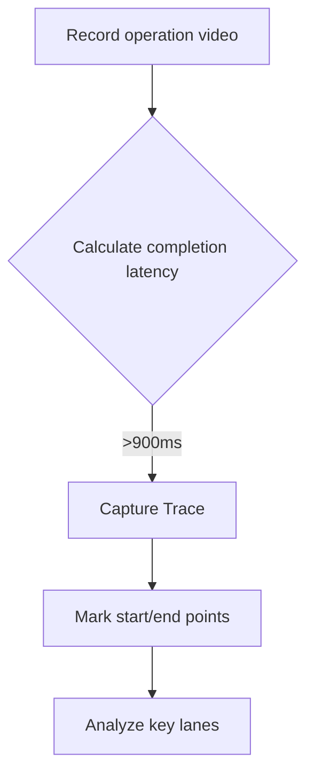
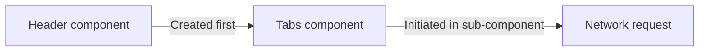

### 🚀 HarmonyOS Completion Latency Optimization Battle Guide: Make Your App Silky Smooth!  

In mobile development, completion latency is the lifeline of user experience! Today, dive into HarmonyOS completion latency optimization, uncover treasure techniques from official docs, and bid farewell to lag for a fluid app experience!  


### I. Why Is Completion Latency So Important?  
Imagine clicking a button, but the screen freezes—such a糟糕 experience makes users lose patience instantly! In HarmonyOS development:  
● **Completion latency** = Time from user click to fully stable & readable UI  
● **Golden standard**: ≤900ms (official HarmonyOS recommendation)  
● **Core impacts**: User retention rate, app ratings, brand image  

*Fig.: Completion latency includes response and rendering latency*  


### II. Three Powerful Tools 🛠️  
#### 1️⃣ AppAnalyzer - Performance Checkup Expert  
```bash  
# Run performance detection in DevEco Studio  
./gradlew appanalyzer --test-type performance  
```  
● One-click detection of completion latency compliance  
● Generates detailed diagnostic reports  
● Supports multi-dimensional testing for compatibility/UX/best practices  

#### 2️⃣ DevEco Profiler - Performance Microscope  
```typescript  
// Insert performance markers in code  
profiler.startTrace('page_switch');  
// ...Page transition code...  
profiler.stopTrace('page_switch');  
```  
● Frame rate analysis: Identify timeout rendering frames (red warning frames)  
● Call stack tracking: ArkTS/Native dual-perspective analysis  
● Enables in-depth optimization for cold start/lag/memory scenarios  

#### 3️⃣ ArkUI Inspector - UI Structure透视仪  
● Real-time viewing of component tree structure  
● Analyze layout hierarchy complexity  
● Locate over-rendered components  


### III. Battle Optimization Full Process 🚦  
#### Step 1: Locate Time-Consuming Bottlenecks  

**Key lane decryption**:  
1. ArkTS Callstack: Identify time-consuming business logic  
2. Native Callstack: Analyze performance black holes in the native layer  
3. Frame: Lock rendering timeout frames  
4. ArkUI Component: Discover component rendering bottlenecks  
5. H:Animator: Optimize animation duration  

#### Step 2: Solutions to Typical Problems  
🔥 **Case 1: Singleton pattern abuse causes 350ms lag**  
**Problem code**:  
```typescript  
// Wrong example: Create+destroy singleton on each tab switch  
Tabs.onChange((index) => {  
  AudioPlayerService.getInstance().stop().then(() => {  
    AudioPlayerService.destroy(); // Destroy instance  
  });  
});  

class AudioPlayerService {  
  static getInstance() {  
    if (!this.instance) {  
      this.instance = new AudioPlayerService(); // Time-consuming creation  
    }  
    return this.instance;  
  }  
}
```  
**Optimization plan**:  
```typescript  
// ✅ Correct approach: Add instance existence check  
Tabs.onChange((index) => {  
  if (AudioPlayerService.hasInstance()) { // New check  
    AudioPlayerService.getInstance().stop();  
  }  
});  

class AudioPlayerService {  
  // New instance check method  
  static hasInstance() {  
    return this.instance !== null;  
  }  
}
```  
**Optimization effect**: Reduces 327ms of invalid creation time!  

🔥 **Case 2: Animation duration causes latency surge**  
**Comparison experiment**:  
```typescript  
// Experimental group: 100ms animation  
Tabs().animationDuration(100)  

// Control group: 1000ms animation  
Tabs().animationDuration(1000)
```  
**Test results**:  
| Animation Duration | Completion Latency |  
|--------------------|--------------------|  
| 100ms              | 99ms               |  
| 1000ms             | 1007ms             |  

**Optimization suggestions**:  
● Default 300ms can be reduced to 150–200ms  
● High-frequency operation areas recommend ≤100ms  
● Use hardware-accelerated animations  

🔥 **Case 3: Incorrect network request placement**  
**Wrong approach**:  

**Result**: Requests blocked by Header creation for >200ms.  
**Correct approach**:  
```typescript  
// Initiate requests early at the page top  
aboutToAppear() {  
  this.loadHeaderData();  
  this.loadTabsData(); // Early parallel loading  
}  

build() {  
  Header({ data: this.headerData })  
  Tabs({ data: this.tabsData })  
}
```  

🔥 **Case 4: Ultra-long frame optimization (92ms→16ms)**  
**Problem location**:  
1. Profiler shows red timeout frames.  
2. Callstack locates native layer time consumption.  
3. Unoptimized image decoding logic found.  
**Optimization plan**:  
```typescript  
Image($r('app.media.largeImage'))  
  .progressiveRendering(true) // Progressive loading  
  .interpolation(ImageInterpolation.Medium) // Balance quality & performance  
  .cachedCount(3) // Cache quantity  
```  


### IV. High-Frequency Optimization Tips Collection 🚀  
#### Network request golden rules  
1. Never initiate critical requests in asynchronous callbacks.  
2. Avoid initiating first-screen requests in sub-components.  
3. Use preloading + caching combos.  

#### Three animation optimization techniques  
```typescript  
// 1.适当 reduce duration  
Navigation().transitionDuration(200)  

// 2. Enable hardware acceleration  
.animation({ curve: Curve.EaseInOut, options: { hardwareAccelerate: true } })  

// 3. Keyframe optimization  
KeyframeAnimation.ofFloat()  
  .duration(150)  
  .onFinish(() => { /* Precision control of end timing */ })  
```  

#### UI rendering acceleration secrets  
```typescript  
// ✅ Recommended approach  
LazyForEach(dataSource, item => {  
  ListItem({ data: item }) // Lazy loading  
}, item => item.id)  

// ❌ Avoid  
ForEach(dataSource, item => { ... }) // Full rendering  

// Component reuse pool  
@ComponentReuse('globalPool')  
struct ReusableCard { ... }  
```  


### V. Summary: Performance Optimization Is Endless  
Through the battle cases in this article, we’ve mastered:  
1. Using three-tool剑客 to precisely locate bottlenecks.  
2. Solving performance issues in four typical scenarios.  
3. Applying network/animation/rendering optimization techniques.  

Remember: Each 100ms latency reduction boosts user retention by 7%! Sustained optimization creates ultimate experiences.  

**Take action now**:  
1. Open DevEco Profiler to analyze your app.  
2. Locate the 3 most time-consuming operations.  
3. Apply any technique from this article for optimization.  

Share your performance optimization tips in the comments! 💬  

Performance optimization isn’t a one-time task—it’s an art of continuous improvement. May your HarmonyOS app be as fast as lightning and as stable as Mount Tai!
